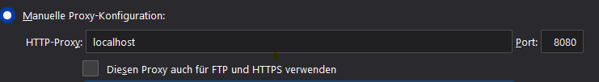
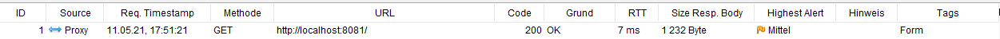
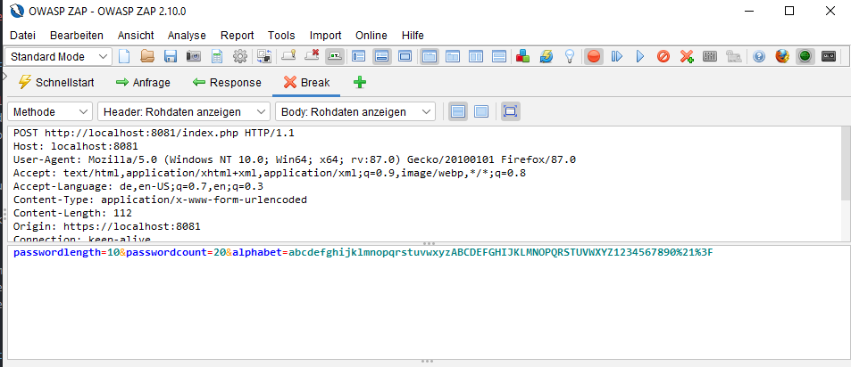
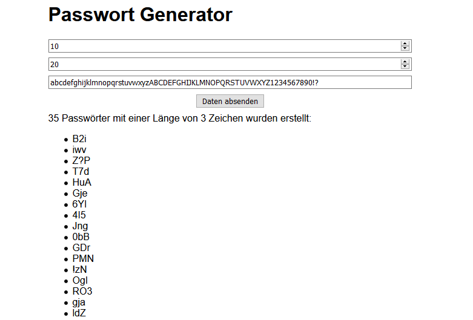

# DASU Uebung 1 - Peter Öttl, Florian Czeczil

## PHP Server
Der PHP Server akzeptiert POST-Requests mit folgenden Parametern:
- Passwortlänge
- Anzahl der Passwörter
- Alphabet zur Erzeugung der Passwörter

Beim Eingang eines HTTP POST-Requests werden die Daten aus der Request gespeichert, und mit `htmlspecialchars()` gesäubert. 

Es wird dann die Angefragte Anzahl der Passwörter generiert, indem ein Buchstabe an einer zufälligen Position im Alphabet genommen und gespeichert wird. Dies wird für die Anzahl an gewünschten Zeichen des Passworts wiederholt.

Am Ende werden die Generierten Passwörter vom Server an den Client gesandt.

## ZAP Attack Proxy
### Überwachen der gesandten Requests
Um die HTTP-Requests aus Firefox Über den ZAP Proxy zu routen muss in Firefox der Proxy gesetzt werden:


Zusätzlich muss in den neueren Versionen von Firefox folgende Einstellung gesetzt werden, um Proxy-Routing auf `localhost` zu erlauben:

```
// about:config in Firefox:

network.proxy.allow_hijacking_localhost: true
```

Nachdem man das selbst siginierte SSL Zertifikat ignoriert hat, und auf den abgefragten Passwortgenerator geleitet wird sieht man im ZAP Attack Proxy bereits den ersten Request:



Außerdem sieht man bereits eine Warnung in der Spalte "Highest Alert", welche symbolisiert das ein Mittelmäßig kritisches Problem besteht.

### Umgehen der Eingabebeschränkung
Im Passwortgenerator wird Client-Side Validation, z.B. für die minimale beziehungsweise maximale Länge der generierten Passwörter, verwendet. 

Wenn man im ZAP Proxy aber einen Break für jede Request setzt (Tools > Toggle Break on all Requests) werden die Requests angezeigt und können bearbeitet werden, bevor sie an das Ziel weitergeleitet werden.

Nachdem also das Input-Form mit den eingegebenen Werten abgeschickt wird erscheint im ZAP Proxy die Request und kann bearbeitet werden:




Wenn man also nun den farbig markierten Query String auf Folgenden Wert ändert:
``` 
passwordlength=3&passwordcount=35&alphabet=abcdefghijklmnopqrstuvwxyzABCDEFGHIJKLMNOPQRSTUVWXYZ1234567890%21%3F
``` 
kann die rein Client-Seitige validierung umgangen werden. Dazu wird in der leiste oben nebem dem roten Breakpoint-Symbol auf den Pfeil für "Weiter bis zum nächsten Request" geklickt. Daraufhin erscheint im Passwort-Generator eine Liste aus 35 Passwörtern, bestehend aus 3 Zeichen, obwohl dies über das Formular nicht möglich wäre.




Auf gleichem Weg könnte übrigens auch das Alphabet manipuliert werden, da es in diesem Fall aber für das Alphabet keine Limitierungen gibt haben wir es für das Beispiel gleich gelassen.

### Denial-of-Service Angriff auf die PHP-Applikation
Wir haben es trotz mehrerer Versuche nicht geschafft, das Service auszuschalten. Das näheste das wir erreicht haben war folgende Fehlermeldung, welche aber mit einem Page-Refresh wieder verschwand und das Tool funktionierte weiter: 


Wir haben folgendes Versucht:
- Überlange Integers für die Anzahl an Passwörtern (daher die Fehlermeldung)
- Strings statt Integers bei den Parametern
- Lange Strings
- OWASP ZAP Automatische Tests/Scans
- OWASP ZAP Fuzzy Input Manipulation
- Wiederholtes Senden von großen Zahlen mit Fuzzer

Wir haben zwar wie im oberen Screenshot gezeigt einen overflow erzeugen können, diesen hat der Server aber gut weggesteckt.